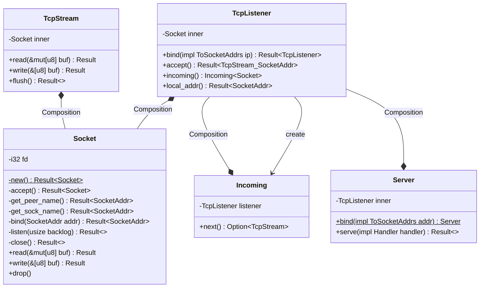

# scratch

A server written (almost) from Scratch using Rust 🦀

## Class Diagram

```mermaid
classDiagram
    TcpStream *-- Socket : Composition
    TcpListener *-- Socket : Composition
    TcpListener --* Incoming : Composition
    TcpListener --* Server : Composition
    TcpListener --> Incoming : create

    class Socket{
      -i32 fd
      -new()$ Result~Socket~
      -accept() Result~Socket~
      -get_peer_name() Result~SocketAddr~
      -get_sock_name() Result~SocketAddr~
      -bind(SocketAddr addr) Result~SocketAddr~
      -listen(usize backlog) Result~~
      -close() Result~~
      +read(&mut[u8] buf) Result<usize>
      +write(&[u8] buf) Result<usize>
      +drop()
    }

    class TcpStream {
      -Socket inner
      +read(&mut[u8] buf) Result<usize>
      +write(&[u8] buf) Result<usize>
      +flush() Result~~
    }

    class TcpListener{
      -Socket inner
      +bind(impl ToSocketAddrs ip) Result~TcpListener~
      +accept() Result~TcpStream_SocketAddr~
      +incoming() Incoming~Socket~
      +local_addr() Result~SocketAddr~
    }

    class Incoming {
        -TcpListener listener
        +next() Option~TcpStream~
    }

    class Server {
        -TcpListener inner
        +bind(impl ToSocketAddrs addr)$ Server
        +serve(impl Handler handler) Result~~
    }
```
